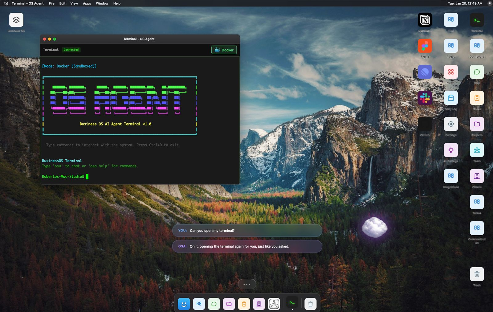
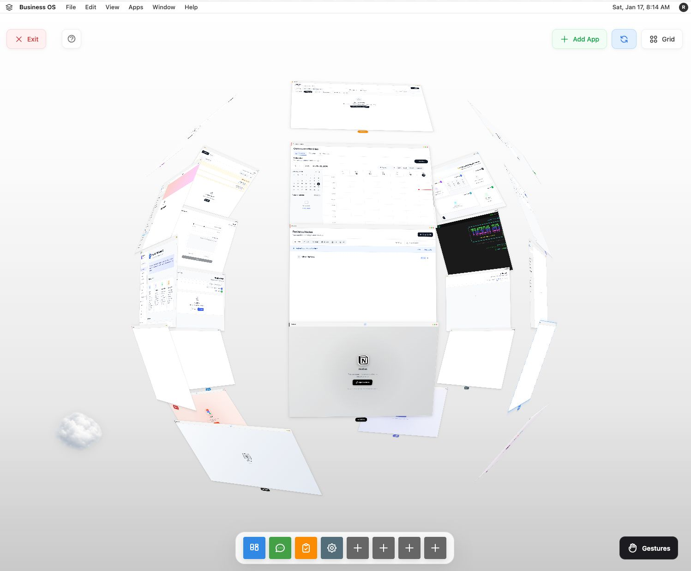

# BusinessOS

**Your business, on autopilot.**

Give your AI agents a home. BusinessOS is a [MIOSA](https://miosa.ai) template — a complete, self-hosted optimal system where AI agents don't just assist your business, they run it. Automate your existing company or build a new one from scratch.

[](LICENSE)
[](https://golang.org)
[](https://kit.svelte.dev)
[](https://typescriptlang.org)
[](CONTRIBUTING.md)

<p align="center">
  
  <br>
  <em>BusinessOS desktop environment — draggable windows, dock, terminal with OSA agent, 3D effects. Your business from another dimension.</em>
</p>

---

## What is this?

[MIOSA](https://miosa.ai) builds optimal systems and interfaces that reduce cognitive load — for humans and AI agents alike. MIOSA templates are the infrastructure your agents work inside. Not chat windows. Not prompt chains. Actual systems with data, workflows, integrations, and UI.

BusinessOS is the template for running a business. It gives your agents a home — with projects, clients, documents, team structure, and the full context of your operation — so they can make decisions, take actions, and deliver results without you babysitting every step.

**Automate your existing company** — plug BusinessOS into your current operation and let agents handle projects, CRM, scheduling, and coordination alongside your team.

**Build a new one** — start from zero and let AI agents run the entire thing. Content, client work, operations — whatever your business does, BusinessOS is the system it runs on.

| Step | What happens |
|------|-------------|
| **01** | Clone the template |
| **02** | Configure your AI providers and integrations |
| **03** | Your agents have a home — projects, clients, docs, context, everything they need to operate |

Think of it like this: your agents need more than a prompt. They need an org chart, a CRM, a knowledge base, a project tracker, a calendar — the same tools a human employee needs to do their job. BusinessOS is all of that in one system, designed for agents to use natively.

---

## The Desktop

BusinessOS isn't a web app — it's a desktop environment. Draggable windows, a dock, snap layouts, wallpapers, and a full 3D mode that lets you view your business from another dimension. Every module opens in its own window. Arrange your workspace however you want.

Run it in the browser, or package it as a **native desktop app with Electron**. One codebase, both targets. The Electron build ships with Electron Forge — `npm run make` and you've got a `.dmg` (macOS), `.exe` (Windows), or `.deb` (Linux).

The desktop is where your agents live. OSA runs in the terminal. Your CRM, projects, docs, and calendar are all open in windows around it. Everything your agent needs is right there — visible, contextual, and interactive.

- **Window management** — drag, resize, snap, minimize, maximize. Multi-window multitasking like a real desktop
- **Dock** — quick access to all modules. Pin your favorites
- **3D Desktop** — not an effect, a full spatial desktop. Your modules exist in three-dimensional space. Rotate, zoom, orbit. Built-in hand motion and gesture controls — navigate your business with your hands
- **Native Electron app** — package as a real desktop application. macOS, Windows, Linux. Auto-updates, system tray, native notifications
- **Wallpapers and theming** — dark glassmorphic UI with customizable backgrounds
- **Terminal** — real PTY terminal via WebSocket (xterm.js) with OSA agent built in. Type `osa` to talk to your agent

<p align="center">
  
  <br>
  <em>3D Desktop — a full spatial environment. Every module lives in 3D space. Hand gesture controls, orbit navigation, grid view. See your entire business from a dimension no dashboard can show you.</em>
</p>

---

## Core Modules

These ship with every BusinessOS instance. They're the tools your agents (and your team) use to operate.

| Module | What it does |
|--------|-------------|
| **Dashboard** | Command center — widgets, tasks, projects, activity feed. The first thing you and your agents see |
| **Projects** | Track work with status, deadlines, team assignments. Agents can create, update, and close projects autonomously |
| **Tasks** | Kanban, list, and calendar views. Agents pick up tasks, report progress, and mark completion |
| **AI Chat** | Multi-mode assistant with Focus Modes — Code, Writing, Analysis, Research, Creative. Full conversation history with RAG |
| **Clients** | Full CRM with deals pipeline, contact management, interaction history. Agents can manage your client relationships |
| **Documents** | Block editor with properties, relations, and AI assistance. Your business knowledge lives here |
| **Contexts** | Business knowledge store — feed your company's brain to your AI. Policies, processes, product info, anything your agents need to know |
| **Team** | Org chart, capacity planning, workload visibility. See who (human or agent) is doing what |
| **Calendar** | Events + Google Calendar sync. Agents can schedule and manage meetings |
| **Terminal** | Real PTY terminal with Docker sandboxing. OSA agent runs here — type natural language, get actions |
| **Desktop** | The window environment itself — drag, snap, 3D, dock, wallpapers |
| **OSA** | AI agent orchestration — multi-agent pipelines, app generation, Signal Theory routing |
| **bosctl CLI** | Command-line interface for process mining operations — 20 subcommands for discovery, conformance, statistics, and more |

### Modules are extensible

BusinessOS has a module system. The core modules above ship by default, but you can:

- **Build your own modules** — create custom modules for your specific domain. A module is a window with its own routes, components, and backend endpoints
- **Pull in open-source tools** — want Notion-like docs? A different CRM? A custom analytics dashboard? Build it as a module or adapt an existing open-source project to run inside BusinessOS
- **Install community modules** — as the ecosystem grows, modules built by others can be installed into your instance
- **Modules for your agents** — build specialized tools that only your agents use. A research module, a reporting module, an outreach module — whatever your agents need to do their job

Every module gets full access to the BusinessOS context — the same projects, clients, documents, and team data that every other module sees. No silos.

---

## Why BusinessOS

| Without BusinessOS | With BusinessOS |
|---|---|
| Your agents have no home. They live in chat windows and forget everything between sessions. | A full system — projects, CRM, docs, calendar, knowledge base — agents operate inside it natively. |
| Context is scattered across 8 tools. You spend more time wiring integrations than doing work. | One platform. Your AI sees everything — projects, clients, docs, team capacity — no context lost. |
| You babysit every AI interaction. Nothing runs without you. | Agents operate autonomously with Signal Theory routing — noise filtered, work prioritized. |
| You're building tools for your agents from scratch every time. | Pre-built modules your agents can use immediately — CRM, project tracking, scheduling, knowledge retrieval. |
| Vendor lock-in. Your data on someone else's servers. | Self-hosted. Your infrastructure. Your data. Fork it, modify it, own it. |

---

## Quick Start

```bash
git clone https://github.com/Miosa-osa/BusinessOS.git
cd BusinessOS

# Start everything
./startup.sh

# Open browser
open http://localhost:5173
```

### Manual Setup

```bash
# Frontend
cd frontend && npm install && npm run dev

# Backend (separate terminal)
cd desktop/backend-go
cp .env.example .env   # Configure your environment
go run ./cmd/server
```

**Requirements:** Node.js 22+, Go 1.24+, PostgreSQL 15+ (with pgvector), Redis 7+

### Run as Native Desktop App (Electron)

Works on **macOS**, **Windows**, and **Linux**.

```bash
cd desktop
npm install
npm run make          # Build native app

# Outputs:
#   macOS   → .dmg
#   Windows → .exe
#   Linux   → .deb / .rpm

# Or run in dev mode
npm run start
```

### Run with Docker

```bash
docker-compose up -d  # Starts PostgreSQL, Redis, backend, frontend
open http://localhost:5173
```

See [docs/development/DEVELOPER_QUICKSTART.md](docs/development/DEVELOPER_QUICKSTART.md) for the full setup guide.

---

## MIOSA — Optimal Systems for AI Agents

[MIOSA](https://miosa.ai) builds optimal systems and interfaces that reduce cognitive load — for humans and AI agents alike. Each MIOSA template is a complete **Optimal System (OS)** — not an operating system, but a purpose-built environment where agents have everything they need to operate autonomously in a specific domain.

Every OS ships with [OSA](osa/) (the Optimal System Agent), [Foundation](https://github.com/Miosa-osa/foundation) (124-component design system), and Signal Theory (intelligent message routing) out of the box.

### Optimal Systems

| OS | Domain | Description |
|----|--------|-------------|
| **BusinessOS** | Operations | **This repo.** Projects, CRM, docs, calendar, team, AI chat — the home base for running a business |
| **ContentOS** | Content & Media | AI-powered content creation, publishing pipelines, editorial workflows, multi-channel distribution |
| **AgencyOS** | Client Services | Client management, project delivery, time tracking, invoicing, team utilization for agencies and studios |
| **CustomOS** | Build Your Own | Blank template — OSA + Foundation + Signal Theory pre-wired. Build the optimal system for your domain |

More at [miosa.ai](https://miosa.ai).

### What every OS ships with

- **[OSA](osa/)** — The Optimal System Agent. Multi-agent orchestration with Signal Theory for intelligent routing, noise filtering, and cost-optimized model selection (8,433 tests)
- **[Foundation](https://github.com/Miosa-osa/foundation)** — 124-component design system. Dark glassmorphic UI with design tokens, accessibility, and theming
- **Signal Theory** — Every message classified into a 5-tuple before processing. Noise filtered before it hits the LLM. Cheap models for simple tasks, powerful models for complex ones
- **ProcessMapViewer** — Interactive DAG visualization with SVG Petri nets, performance overlays, bottleneck detection, and pan/zoom
- **KPI Dashboard** — Real-time process mining metrics (ConformanceScore, VariantDistribution, BottleneckHeatmap, CycleTimeTrend)

```
MIOSA
│
├── Optimal Systems
│   ├── BusinessOS    → ★ This repo — run a business
│   ├── ContentOS     → Create & publish content
│   ├── AgencyOS      → Deliver client work
│   └── CustomOS      → Build your own
│
├── Core
│   ├── OSA           → Optimal System Agent (Elixir/OTP + Rust, 1,108 tests)
│   ├── Foundation    → 124-component design system
│   └── Signal Theory → Message classification & intelligent routing
│
└── miosa.ai
```

### What makes an Optimal System

- A complete environment where AI agents can operate — not just tools, but the system they live in
- Ships with OSA embedded for multi-agent orchestration
- Uses Foundation design system for consistent, accessible UI
- Follows MIOSA architectural patterns — signal-based routing, clean architecture, multi-tenant ready
- Self-hosted. Open-source. Your data stays yours

### Deploy at scale with MIOSA Platform

Run BusinessOS self-hosted, or deploy many instances at scale on [MIOSA Platform](https://miosa.ai). The platform gives you a **command center** to manage all your Optimal Systems and agents from one place:

- **Multi-OS management** — Deploy and monitor multiple BusinessOS, ContentOS, or AgencyOS instances from a single dashboard
- **Agent-agnostic** — Manage OSA agents, OpenClaw, NanoClaw, Claude, or any agent that can receive a heartbeat. If it can take instructions, it works here
- **Centralized control** — Budgets, governance, audit logs, and cost tracking across all your systems and agents
- **Scale horizontally** — One command center, unlimited Optimal Systems. Run one business or a portfolio of them

Self-hosted works out of the box. The platform is for when you need to orchestrate across multiple systems.

### OSA — The Optimal System Agent

[OSA](osa/) lives inside every Optimal System. It's agent-agnostic — it orchestrates whatever agents you bring:

- **Signal Theory** — 5-tuple message classification. Noise → filtered. Simple tasks → cheap models. Complex tasks → powerful models. ~75% cost reduction vs naive routing
- **SORX Engine** — Skill execution with credential management, callbacks, and sandboxed runtime
- **Multi-Agent Orchestration** — Opus plans, specialized workers execute, results synthesized
- **Bring any agent** — OSA, OpenClaw, NanoClaw, Claude Code, Codex, Cursor — anything that can receive instructions
- **5-Mode System** — EXECUTE, BUILD, MONITOR, DESIGN, COMMUNICATE
- **1,108 tests** — Elixir/OTP + Rust. Runs locally. Apache 2.0

---

## Architecture

```
┌─────────────────────────────────────────────────────────────┐
│                        FRONTEND                              │
│              SvelteKit 2 · Svelte 5 Runes                    │
│            TypeScript (strict) · Tailwind v4                 │
│               http://localhost:5173                           │
│                                                              │
│   588 components · 92 routes · Desktop window manager        │
└──────────────────────────┬──────────────────────────────────┘
                           │
                  Vite Proxy (/api/*)
                           │
┌──────────────────────────▼──────────────────────────────────┐
│                       GO BACKEND                             │
│                Gin · pgx/v5 · JWT · slog                     │
│               http://localhost:8001                           │
│                                                              │
│   200+ REST endpoints · SSE streaming · WebSocket            │
│   Agent orchestration · SORX engine · Signal routing         │
│                                                              │
│   Handler → Service → Repository (clean architecture)        │
└──────────┬──────────────┬──────────────┬────────────────────┘
           │              │              │
 ┌─────────▼────────┐ ┌──▼──────┐ ┌─────▼──────────────┐
 │   PostgreSQL     │ │  Redis  │ │   AI Providers     │
 │  + pgvector      │ │ cache + │ │ Claude · Groq      │
 │  (RAG / search)  │ │ pub/sub │ │ Ollama (local)     │
 └──────────────────┘ └─────────┘ └────────────────────┘
```

### Backend Flow

```
HTTP Request → Middleware (auth, CORS, rate limit, security headers)
                   → Handler (validation, serialization)
                       → Service (business logic, AI orchestration)
                           → Repository (data access via sqlc)
                               → PostgreSQL / Redis / AI Provider
```

### Frontend Flow

```
Route (+page.svelte) → Components → Stores → API Client → Backend
                           │
                    Svelte 5 Runes ($state, $derived, $effect)
                    Callback props (no createEventDispatcher)
```

---

## Tech Stack

### Frontend

| Layer | Technology |
|-------|-----------|
| Framework | SvelteKit 2 + Svelte 5 |
| Language | TypeScript (strict mode) |
| Styling | TailwindCSS v4 |
| Reactivity | Runes — `$state`, `$derived`, `$effect` |
| Terminal | xterm.js (real PTY via WebSocket) |
| Window Manager | Custom desktop environment with snap, 3D effects |
| State | Domain-split stores (desktop, window, chat, etc.) |

### Backend

| Layer | Technology |
|-------|-----------|
| Language | Go 1.24 |
| HTTP | Gin |
| Database | PostgreSQL 15 + pgvector |
| Query Layer | sqlc (generated, type-safe) |
| Cache | Redis 7 |
| Auth | JWT + Google OAuth + CSRF cookies |
| AI | Anthropic Claude SDK, Groq, Ollama |
| Logging | slog (structured) |
| Packages | 28 internal packages |

### AI Providers

| Provider | Role |
|----------|------|
| Anthropic Claude | Planning (Opus), execution (Sonnet), utility (Haiku) |
| Groq | Fast cloud inference |
| Ollama | Local LLMs — Qwen, Llama, Mistral |

---

## Project Structure

```
BusinessOS/
├── frontend/                        # SvelteKit application
│   └── src/
│       ├── lib/
│       │   ├── api/                 # API client modules
│       │   ├── components/          # 588 Svelte components
│       │   │   ├── chat/            # AI chat system
│       │   │   ├── desktop/         # Desktop window environment
│       │   │   ├── desktop3d/       # 3D desktop effects
│       │   │   ├── osa/             # OSA agent UI
│       │   │   ├── settings/        # Settings panels
│       │   │   ├── ui/              # Generic UI primitives
│       │   │   └── ...              # 30+ feature domains
│       │   ├── stores/              # Domain-split Svelte stores
│       │   ├── services/            # Voice, permissions, integrations
│       │   └── utils/               # Shared utilities
│       └── routes/                  # File-based routing (92 routes)
│
├── desktop/backend-go/              # Go backend
│   ├── cmd/server/                  # Entry point
│   └── internal/
│       ├── agents/                  # Multi-agent orchestration
│       ├── appgen/                  # App generation pipeline
│       ├── cache/                   # Redis caching layer
│       ├── carrier/                 # CARRIER deployment system
│       ├── config/                  # Configuration + validation
│       ├── container/               # Docker sandbox management
│       ├── database/                # PostgreSQL + migrations + sqlc
│       ├── handlers/                # HTTP / WebSocket / SSE handlers
│       ├── integrations/            # Google, Microsoft, HubSpot, Notion
│       ├── middleware/              # Auth, CORS, rate limiting, security
│       ├── security/                # Encryption, audit, governance
│       ├── services/                # Business logic + AI workflows
│       ├── signal/                  # Signal Theory implementation
│       ├── sorx/                    # SORX skill execution engine
│       ├── streaming/               # SSE event streaming
│       ├── terminal/                # PTY terminal + WebSocket
│       └── workers/                 # Background job workers
│
├── osa/                             # Optimal System Agent (Elixir/OTP + Rust)
│
├── docs/                            # Documentation
│   ├── adrs/                        # Architecture Decision Records
│   ├── api/                         # API specs
│   ├── architecture/                # System architecture
│   ├── database/                    # DB setup + migrations
│   ├── deployment/                  # Deployment guides
│   ├── development/                 # Developer guides
│   └── osa/                         # OSA documentation
│
├── .github/workflows/               # CI/CD (9 workflows)
├── docker-compose.yml               # Local development stack
└── Makefile                         # Common commands
```

---

## Configuration

### Environment Variables

```env
# Server
SERVER_PORT=8001
ENVIRONMENT=development

# Database
DATABASE_URL=postgresql://user@localhost:5432/business_os?sslmode=disable

# Auth
SECRET_KEY=your-secret-key-min-32-chars
JWT_SECRET=your-jwt-secret

# AI Providers (at least one required)
ANTHROPIC_API_KEY=sk-ant-...
GROQ_API_KEY=gsk_...
OLLAMA_LOCAL_URL=http://localhost:11434

# Google OAuth (optional)
GOOGLE_CLIENT_ID=your-client-id
GOOGLE_CLIENT_SECRET=your-client-secret

# Redis
REDIS_URL=redis://localhost:6379

# CORS
ALLOWED_ORIGINS=http://localhost:5173
```

### Ports

| Service | Port | Required |
|---------|------|----------|
| Frontend | 5173 | Yes |
| Backend | 8001 | Yes |
| PostgreSQL | 5432 | Yes |
| Redis | 6379 | Yes |
| Ollama | 11434 | Optional |

---

## Development

### Running Tests

```bash
# Backend
cd desktop/backend-go && go test ./...

# Frontend
cd frontend && npm test

# Integration tests (requires PostgreSQL)
cd desktop/backend-go && go test -tags=integration ./...
```

### CI/CD

9 GitHub Actions workflows:

| Workflow | Triggers |
|----------|----------|
| Backend Unit Tests | push/PR to main |
| Frontend Tests & Build | push/PR to main |
| Integration Tests | push/PR to main |
| E2E Tests | push/PR to main |
| Security Scanning | push/PR + weekly |
| Security Tests | push/PR + weekly |
| Performance Tests | push/PR to release/** + weekly |
| Deploy Backend | push to main → GCP Cloud Run |
| Deploy Frontend | push to main → Vercel |

### Branch Strategy

| Branch | Purpose |
|--------|---------|
| `main` | Stable, production-ready |
| `feat/*` | Feature development |
| `fix/*` | Bug fixes |

---

## Documentation

| Guide | Description |
|-------|-------------|
| [START_HERE.md](docs/START_HERE.md) | Onboarding guide |
| [DEVELOPER_QUICKSTART.md](docs/development/DEVELOPER_QUICKSTART.md) | Dev environment setup |
| [BACKEND.md](docs/development/BACKEND.md) | Go backend reference |
| [FRONTEND.md](docs/development/FRONTEND.md) | SvelteKit frontend reference |
| [API_REFERENCE.md](docs/api/API_REFERENCE.md) | 200+ endpoint API docs |
| [DATABASE_SETUP.md](docs/database/DATABASE_SETUP.md) | PostgreSQL + pgvector setup |
| [DEPLOYMENT_GUIDE.md](docs/deployment/DEPLOYMENT_GUIDE.md) | Deployment guide |
| [CONTRIBUTING.md](CONTRIBUTING.md) | Contribution guidelines |
| [SECURITY.md](SECURITY.md) | Security policy |

---

## Contributing

We welcome contributions. See [CONTRIBUTING.md](CONTRIBUTING.md) for guidelines.

```bash
# Fork, clone, branch
git checkout -b feat/your-feature

# Make changes, test
cd desktop/backend-go && go test ./...
cd frontend && npm test

# Submit PR
```

---

## License

Apache 2.0 — see [LICENSE](LICENSE) for details.

---

<p align="center">
  <strong>BusinessOS</strong> — a <a href="https://miosa.ai">MIOSA</a> template<br>
  Your business, on autopilot.
</p>
