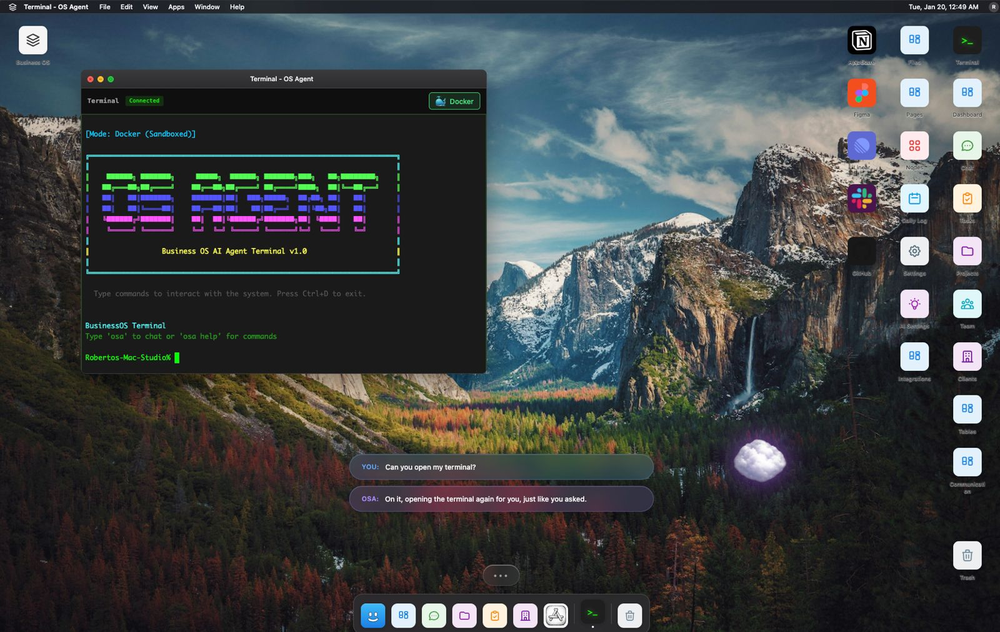
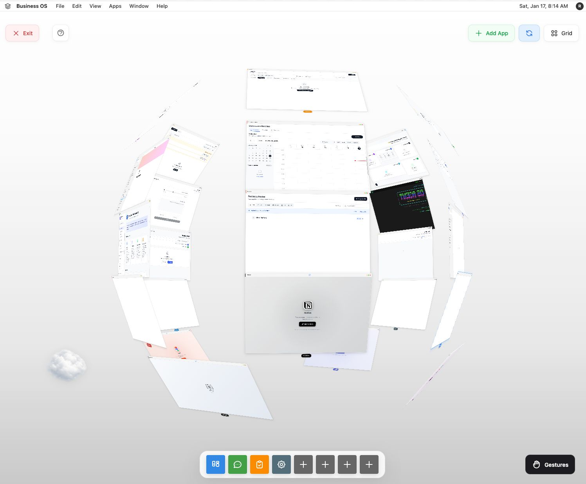

# BusinessOS

**Give your business and its agents a place to work.**

[](LICENSE)
[](https://go.dev)
[](https://kit.svelte.dev)
[](https://typescriptlang.org)
[](CONTRIBUTING.md)

<p align="center">
  
  <br>
  <em>A local-first desktop for the work, knowledge, people, and agents inside a business.</em>
</p>

BusinessOS is an open-source operating layer for running a business.
It gives each organization a place to model its work through isolated workspaces, purpose-built modules, apps, windows, roles, teams, and operational records.

Optimal Engine supplies governed knowledge, memory, search, and context.
BusinessOS supplies the interface where people and agents use that context to perform work.

## What You Get

- A real desktop environment with draggable, resizable, and persistent module windows.
- A local Go backend with PostgreSQL, Redis, authentication, workspace isolation, roles, and teams.
- A bundled Optimal Engine for governed knowledge, memory, search, and agent context.
- A real local terminal surface powered by a PTY, xterm.js, and your own shell environment.
- A foundational module map for operations, knowledge, relationships, projects, tasks, communication, and integrations.
- A custom-module builder for shaping the system around how your business actually works.
- A clean first workspace with no sample company, fake clients, or private MIOSA data.

BusinessOS is a foundation, not a pretend finished business.
The shell and core primitives are present, but the meaning, records, workflows, policies, and specialized modules come from your organization.

<p align="center">
  
  <br>
  <em>The optional spatial desktop lets you arrange and navigate an operating system beyond a flat dashboard.</em>
</p>

## Start Here

The supported source-development path is:

```bash
git clone https://github.com/Miosa-osa/BusinessOS.git
cd BusinessOS
make onboard
```

`make onboard` performs the complete first run:

1. Checks every required tool and reports exact installation guidance.
2. Creates local environment files without replacing existing configuration.
3. Initializes an isolated PostgreSQL cluster under `.run/`.
4. Creates the local BusinessOS database when it is absent.
5. Starts isolated Redis and Optimal Engine services.
6. Installs frontend and desktop dependencies.
7. Builds and starts the Go backend, SvelteKit frontend, and Electron shell.
8. Verifies database migrations, schema health, service readiness, and the desktop process.

The first run downloads dependencies and Electron, so it takes longer than later starts.

When verification finishes, open `http://localhost:5273/register` and create a local account.
No Google credentials, hosted account, or MIOSA subscription is required.
BusinessOS creates a clean local workspace with the foundational module map but no example company, client records, tasks, messages, calendar events, or private data.

The empty workspace is intentional.
Start with the business, decide what each module needs to mean, and add records or purpose-built modules as the operating model becomes explicit.

### What the first run creates

The onboarding flow creates only the infrastructure required to begin:

- One local user account that you register yourself.
- One organization and one workspace owned by that account.
- Workspace roles, membership, settings, and the foundational module map.
- Empty operational tables ready for your real data.
- A clean local Optimal Engine data directory.

It does not seed a CRM, calendar, inbox, projects, tasks, conversations, clients, or example knowledge.

### Build modules from the business

Open a foundational module to start defining that part of the organization.
If a custom module has not been implemented yet, BusinessOS shows an intentional unshaped-module screen instead of a raw 404.

A useful module starts with a real responsibility, workflow, or decision boundary:

1. Name the business capability in the language your organization uses.
2. Decide which people and agents work inside it.
3. Define the records, states, policies, and outcomes it owns.
4. Connect the existing tools that already participate in that work.
5. Build only the interface and automation that capability requires.

Use an existing foundational route as the implementation reference, then follow the repository standards in [Contributing](CONTRIBUTING.md).

## Prerequisites

Use the versions declared by the repository where possible.

| Tool | Required version | Purpose |
| --- | --- | --- |
| Node.js | 22 or newer | Frontend and Electron |
| pnpm | 9.15.4 | Frontend package manager |
| Go | 1.26.2 | Backend |
| PostgreSQL | 14 or newer | Operational database |
| Redis | 7 or newer | Cache, sessions, and coordination |
| Elixir and Mix | Current stable | Bundled Optimal Engine |
| Python | 3 | Detached local process launcher |

On macOS:

```bash
brew install node@22 go postgresql@16 redis elixir python
corepack enable
corepack prepare pnpm@9.15.4 --activate
```

Do not start global PostgreSQL or Redis services for BusinessOS.
The launcher runs isolated instances on repository-specific ports.

## Daily Development

```bash
make dev-local           # Start the stack
make dev-local-verify    # Prove every required service is healthy
make dev-local-status    # Show service state and ports
make dev-local-logs      # Follow application logs
make dev-local-restart   # Restart after pulling changes
make dev-local-stop      # Stop services and preserve data
```

For a browser-only or headless development session, use `BUSINESSOS_HEADLESS=1 make dev-local`.

Default local endpoints:

| Service | URL |
| --- | --- |
| Frontend | `http://localhost:5273` |
| Backend | `http://localhost:8801` |
| Optimal Engine | `http://localhost:4200` |
| PostgreSQL | `127.0.0.1:25432` |
| Redis | `127.0.0.1:26379` |

Edit `.env.dev` to change local ports.
The launcher synchronizes those values into generated frontend and backend environment files.

## Local Data

Local runtime state lives under `.run/`.
It is ignored by Git and preserved across normal stops and restarts.

Do not delete `.run/pgdata` to fix a startup problem.
That directory contains the local PostgreSQL database.

The backend owns the migration ledger.
Do not manually apply individual migration files or replay `schema.sql` against an existing database.

Use:

```bash
make db-schema-check
make check-schema
```

## Authentication and Team Access

A clean local installation can create and use local accounts without shared secrets.

Google sign-in and Google integrations require OAuth credentials supplied out-of-band.
Never commit OAuth credentials, API keys, database credentials, or generated environment files.

The canonical Google authentication callback is:

```text
http://localhost:8801/api/auth/google/callback
```

Tool integrations have their own exact callback URLs.
See [Team Onboarding](docs/development/TEAM_ONBOARDING.md) before configuring them.

## Connect Optimal Engine

The launcher uses an engine already running on port `4200` when one is available.
Otherwise, it starts the bundled engine with clean local data under `.run/optimal-engine-data`.

Inside BusinessOS:

1. Open **Settings**.
2. Select **Optimal Engine**.
3. Choose the built-in local engine or configure an existing engine URL.
4. Test the connection.
5. Select the engine workspace mapped to the BusinessOS workspace.

BusinessOS must never bundle Roberto's private OptimalOS data.
Each downloaded installation starts with its own clean local engine.

## Architecture

```text
Electron desktop shell
        |
SvelteKit frontend :5273
        |
Go backend :8801
   |             |
PostgreSQL     Redis
   |
Optimal Engine :4200
```

Core directories:

```text
desktop/             Electron shell and Go backend
frontend/            SvelteKit application
optimal-engine/      Optimal Engine subtree and SDKs
workspaces/          Workspace templates and private projections
docs/                Architecture, development, deployment, and operations
scripts/             Setup, verification, build, and release automation
```

## Tests

```bash
make test-dev-local-launcher
make test-backend
make test-frontend
make check-schema
```

Before handing work to another developer, run:

```bash
make dev-local-verify
make test
```

## Docker

Docker is an alternative deployment-shaped development path.
It is not the primary Electron development workflow.

```bash
make setup
make status
make logs
make down
```

## Documentation

- [Documentation Index](docs/README.md)
- [Developer Quick Start](docs/development/DEVELOPER_QUICKSTART.md)
- [Team Onboarding](docs/development/TEAM_ONBOARDING.md)
- [Common Issues](docs/development/COMMON_ISSUES.md)
- [Local Runtime SOP](docs/operations/businessos-local-runtime-sop.md)
- [Workspace and Engine Routing](docs/WORKSPACE_ENGINE_ROUTING.md)
- [Contributing](CONTRIBUTING.md)
- [Security](SECURITY.md)

## Repository Policy

This is the public, open-source BusinessOS repository.
It is generated from the product source through a governed projection that removes private workspace data, credentials, hosted billing controls, and internal administration surfaces.

Licensing terms for redistributed components must be confirmed before publishing a release.
